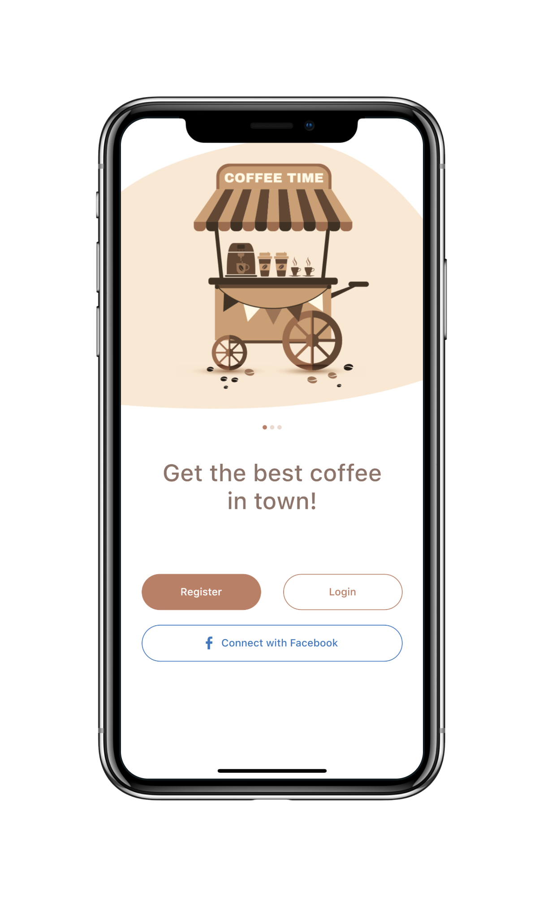
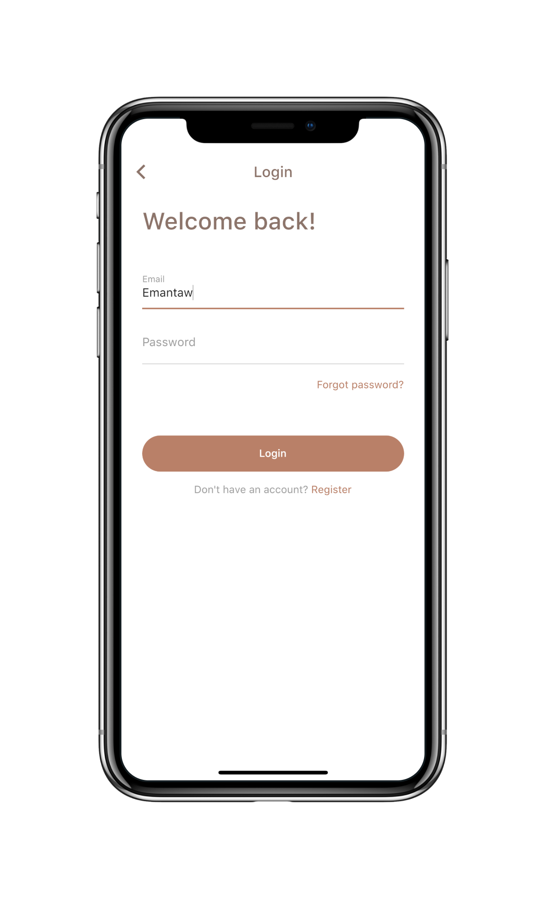

# Flutter UI - Coffee App

English------[中文](README_CN.md)

### Introduction

The coffee application is divided into 3 pages, namely the splash screen page, the main page and the login page.

### Video

#### part1

YouTube : [Watch it on YouTube](https://youtu.be/RNQ1meh9k48)

Bilibili : [Watch it on Bilibili](https://www.bilibili.com/video/BV1pK411H7uG/)

#### part2

YouTube : [Watch it on YouTube](https://youtu.be/FmrnHkI3_Ow)

Bilibili : [Watch it on Bilibili](https://www.bilibili.com/video/BV1Q5411h7o8/)

### UI 

 - Coffee App App Design by [Eman Tawfik](https://dribbble.com/EmanTawfik)

### Coffee App Design UI

### Coffee App Final UI

     

     

