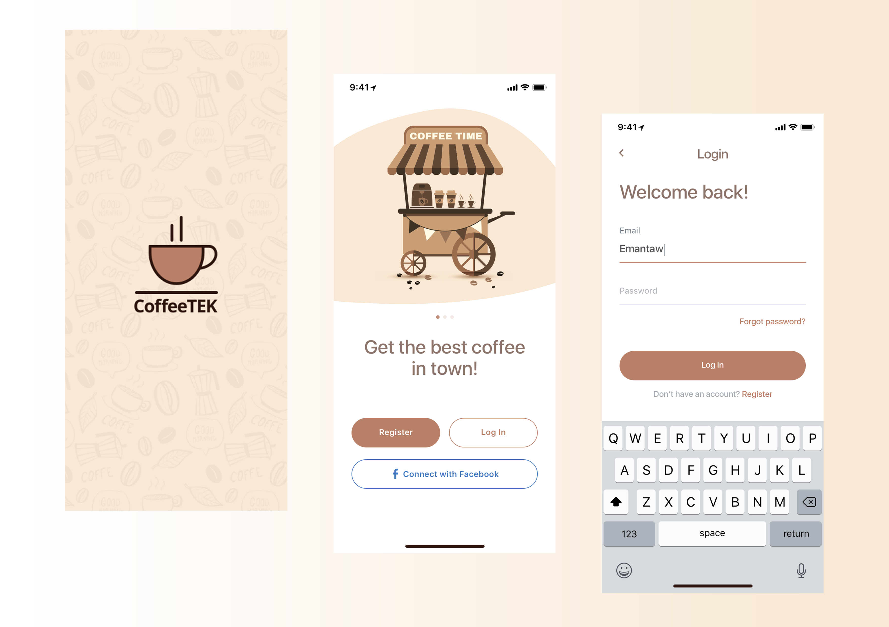
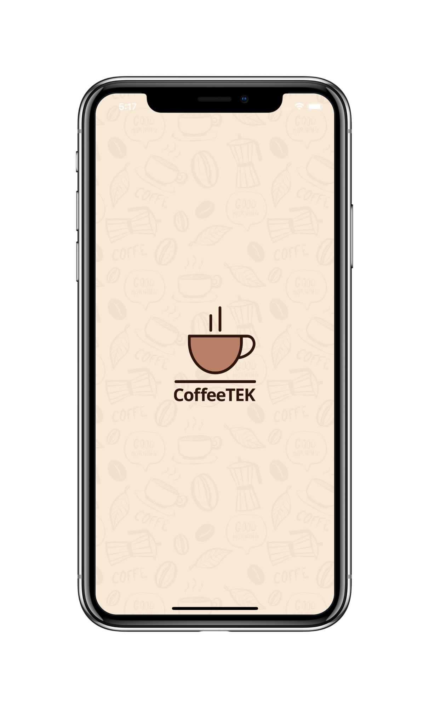
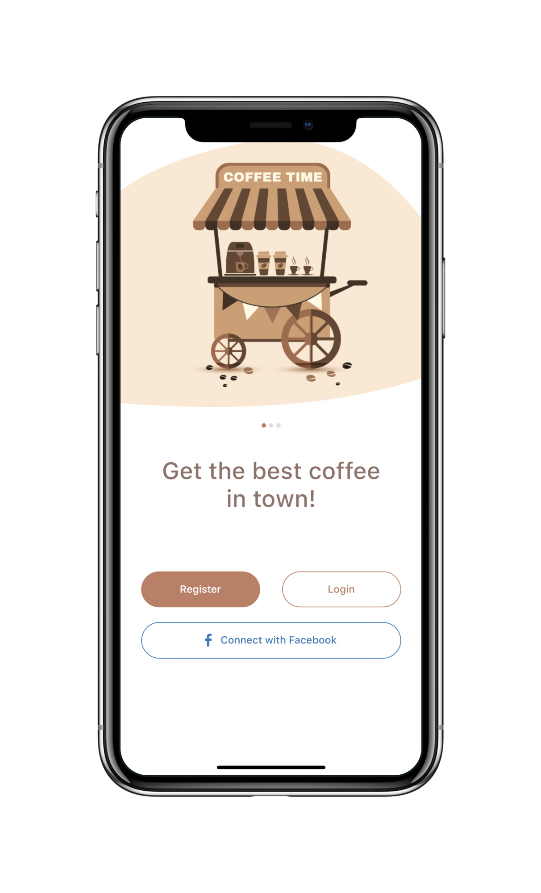
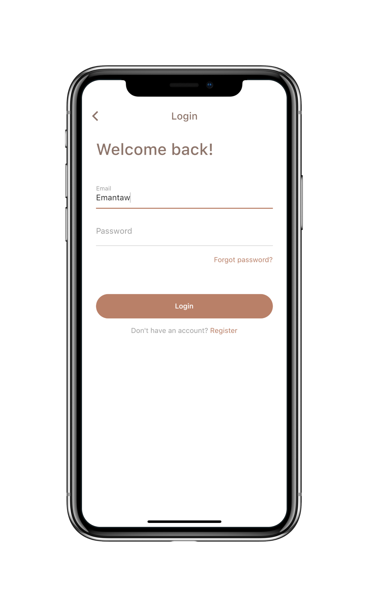

# Flutter UI - Coffee App

[English](README.md)------中文

### 介绍

咖啡应用分为3个页面，分别为闪屏页面、主页面以及登录页面。

### 视频

YouTube : [观看地址](https://youtu.be/RNQ1meh9k48)

哔哩哔哩 : [观看地址](https://www.bilibili.com/video/BV1pK411H7uG/)

### 设计 

 - 设计者:  Coffee App Design by [Eman Tawfik](https://dribbble.com/EmanTawfik)

### Coffee App 设计稿

### Coffee App 最终完成

    

